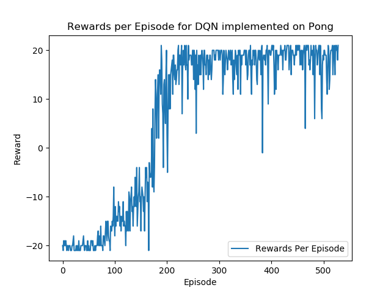

# DQN-Atari
Deep Q-network implementation for [Pong-vo](https://gym.openai.com/envs/Pong-v0/).  The implementation follows from the paper - [Playing Atari with Deep Reinforcement Learning](https://arxiv.org/abs/1312.5602) and [Human-level control through deep reinforcement
learning](https://web.stanford.edu/class/psych209/Readings/MnihEtAlHassibis15NatureControlDeepRL.pdf).
## Results
### Video of Gameplay - DQN Nature Paper
[](http://www.youtube.com/watch?v=DcyMFIKsVNI "DQN For Atari Pong")
### Reward per Episode



## Summary of Implementation
### DQN Nature Architecture Implementation
- Input : 84 × 84 × 4 image (using the last 4 frames of a history)
- Conv Layer 1 : 32 8 × 8 filters with stride 4
- Conv Layer 2: 64 4 × 4 filters with stride 2
- Conv Layer 3: 64 3 × 3 filters with stride 1
- Fully Connected 1 : fully-connected and consists of 256 rectifier units
- Output : fully connected linear layer with a single output for each valid action.

### DQN Neurips Architecture Implementation
- Input : 84 × 84 × 4 image (using the last 4 frames of a history)
- Conv Layer 1 : 16 8 × 8 filters with stride 4
- Conv Layer 2: 32 4 × 4 filters with stride 2
- Fully Connected 1 : fully-connected and consists of 256 rectifier units
- Output : fully connected linear layer with a single output for each valid action.
#### Other Params
- Optimizer: RMSProp 
- Batch Size:  32
- E-greedy : 0.1


## How to run
### Create a new environment
Example: 
```
conda create -n dqn_pong
``` 

### Install Dependencies
```
pip install -r requirements.txt
```
### To use `gym.wrappers.Monitor` to record the last episode
```
sudo apt-get install ffmpeg
```

### Run Training from Scratch
```
python train_atari.py
```
### Use a trained agent
```
python train_atari.py --load-checkpoint-file results/checkpoint_dqn_nature.pth
```
## View Progress
A video is recorded every 50 episodes. See videos in `/video/` folder. 
